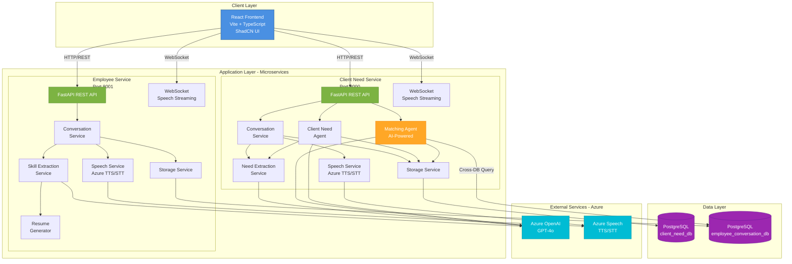
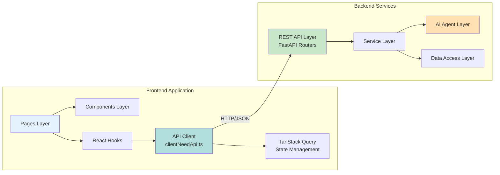
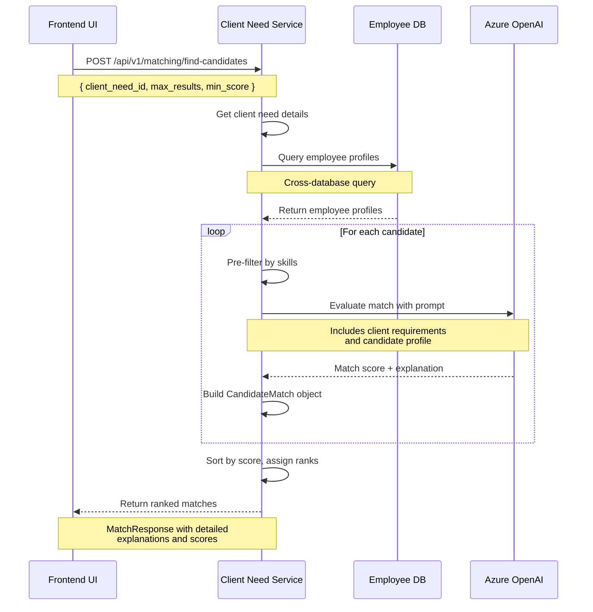
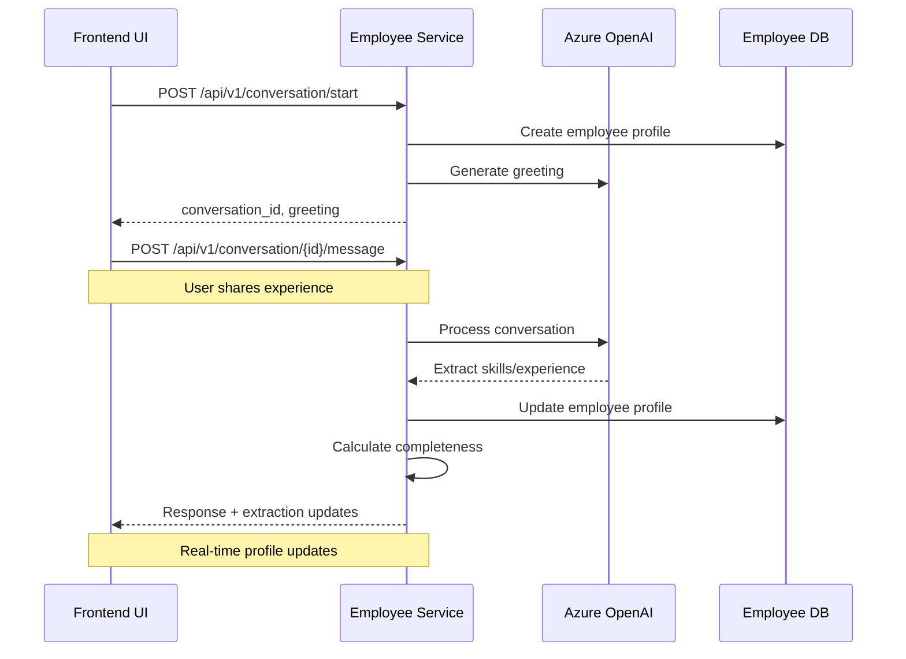
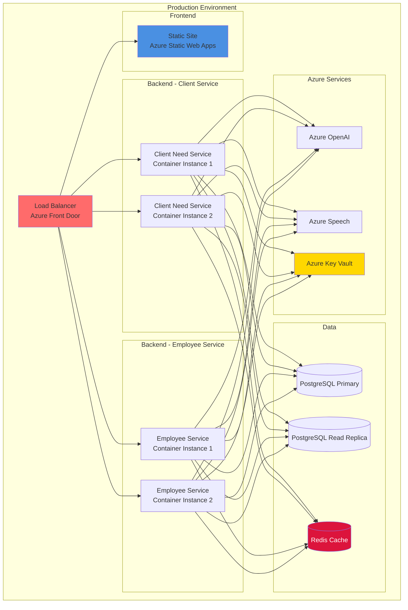
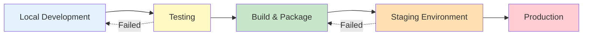

# ASPIRE2026 Application Architecture

## System Overview

ASPIRE2026 is an AI-powered talent matching platform that connects employees with client opportunities through conversational interfaces. The system uses microservices architecture with separate services for employee and client management, integrated with Azure AI services.

---

## High-Level Architecture Diagram



---

## Detailed Component Architecture



---

## Key Features by Service

### Client Need Service (Port 8000)

**API Endpoints:**
- `/api/v1/health` - Health check
- `/api/v1/conversation/*` - Conversation management
- `/api/v1/client-needs/*` - Client need CRUD operations
- `/api/v1/intake/*` - Document/audio intake (PDF, audio, text)
- `/api/v1/matching/*` - AI-powered candidate matching
- `/api/v1/speech/*` - Speech synthesis and recognition
- `/api/v1/agent/*` - AI agent processing

**Core Services:**
1. **Conversation Service** - Manages conversational interactions with clients
2. **Need Extraction Service** - Extracts structured requirements using AI
3. **Matching Agent** - AI-powered employee-to-client need matching
4. **Speech Service** - Azure TTS/STT integration
5. **Client Need Agent** - Orchestrates requirement gathering workflow
6. **Storage Service** - Database operations for client needs

**Key Capabilities:**
- Conversational requirement gathering (text + voice)
- Multi-format intake (PDF, audio, text)
- AI-powered requirement extraction
- Intelligent candidate matching with explanations
- Real-time completeness tracking
- Speech-to-text and text-to-speech

### Employee Conversation Service (Port 8001)

**API Endpoints:**
- `/api/v1/health` - Health check
- `/api/v1/conversation/*` - Conversation management
- `/api/v1/employee-profiles/*` - Employee profile operations
- `/api/v1/speech/*` - Speech synthesis and recognition
- `/api/v1/agent/*` - AI agent interactions

**Core Services:**
1. **Conversation Service** - Manages employee conversations
2. **Skill Extraction Service** - AI-powered profile extraction
3. **Speech Service** - Azure TTS/STT integration
4. **Resume Generator** - PDF CV generation
5. **Storage Service** - Database operations for employee profiles

**Key Capabilities:**
- Conversational profile building (text + voice)
- Real-time skill/experience extraction
- AI-enhanced CV generation
- Profile completeness scoring
- Dynamic resume updates

---

## Data Models

### Client Need Entity

```
client_needs
├── id (UUID)
├── client_name
├── client_company
├── client_email
├── project_title
├── project_description
├── required_skills (JSONB Array)
├── skill_level
├── certifications_required (JSONB Array)
├── required_roles (JSONB Array with categories)
├── timeline_duration_weeks
├── timeline_start_date
├── work_location
├── budget_min/max/type
├── urgency_level
├── profile_completeness_score
├── missing_information (JSONB Array)
├── conversation_status
└── timestamps
```

### Employee Profile Entity

```
employee_profiles
├── id (UUID)
├── full_name
├── email
├── phone
├── summary
├── experience_years
├── skills (JSONB Array)
├── certifications (JSONB Array)
├── education (JSONB Array)
├── experience (JSONB Array)
├── preferred_roles (JSONB Array)
├── profile_completeness_score
└── timestamps
```

### Match Result Entity

```
CandidateMatch
├── employee_profile_id
├── employee_name
├── match_score (0-100)
├── confidence (0.0-1.0)
├── rank (1-N)
├── explanation
│   ├── strengths (Array)
│   ├── gaps (Array)
│   ├── skill_matches (Array)
│   └── additional_notes
├── experience_years
├── key_skills
└── current_availability
```

---

## Technology Stack

### Frontend
- **Framework**: React 18.3
- **Build Tool**: Vite 5.4
- **Language**: TypeScript 5.8
- **UI Library**: ShadCN UI (Radix UI primitives)
- **Styling**: Tailwind CSS 3.4
- **State Management**: TanStack Query (React Query) 5.83
- **Routing**: React Router 6.30
- **Form Handling**: React Hook Form 7.61 + Zod 3.25
- **Charts**: Recharts 2.15

### Backend
- **Framework**: FastAPI (Python)
- **Language**: Python 3.14
- **Database**: PostgreSQL with asyncpg
- **ORM**: SQLAlchemy (async)
- **Validation**: Pydantic v2
- **AI Framework**: LangChain
- **Testing**: pytest, httpx

### External Services
- **AI**: Azure OpenAI (GPT-4o deployment)
- **Speech**: Azure Speech Services (TTS/STT)
- **PDF Generation**: ReportLab

### Infrastructure
- **API Gateway**: None (direct service access)
- **Authentication**: Not implemented yet
- **Deployment**: Local development
- **Monitoring**: FastAPI built-in logging

---

## API Communication Flow

### Example: Client Need Matching Flow



### Example: Employee Profile Building Flow



---

## Security Considerations

### Current State
- ⚠️ No authentication/authorization implemented
- ⚠️ Direct database access (no connection pooling limits)
- ⚠️ No rate limiting
- ⚠️ CORS not configured for production
- ⚠️ API keys stored in environment variables

### Recommended Improvements
1. Implement OAuth2/JWT authentication
2. Add API key management system
3. Enable CORS with whitelist
4. Add rate limiting per client
5. Implement request validation middleware
6. Use Azure Key Vault for secrets
7. Add audit logging for sensitive operations
8. Implement role-based access control (RBAC)

---

## Scalability Considerations

### Current Limitations
- Single instance per service
- No load balancing
- Synchronous AI calls (blocking)
- No caching layer
- Direct database connections

### Scaling Strategy
1. **Horizontal Scaling**
   - Containerize services (Docker)
   - Deploy on Kubernetes/AKS
   - Add load balancer (Azure Load Balancer)

2. **Database Optimization**
   - Connection pooling (asyncpg pools)
   - Read replicas for queries
   - Partition large tables
   - Add caching layer (Redis)

3. **AI Service Optimization**
   - Implement request batching
   - Add response caching
   - Use Azure API Management
   - Implement circuit breakers

4. **Frontend Optimization**
   - CDN for static assets
   - Code splitting
   - Service worker for offline support
   - WebSocket connection pooling

---

## Deployment Architecture



---

## Monitoring and Observability

### Recommended Tools
1. **Application Monitoring**: Azure Application Insights
2. **Log Aggregation**: Azure Log Analytics
3. **Metrics**: Prometheus + Grafana
4. **Tracing**: OpenTelemetry
5. **Alerting**: Azure Monitor Alerts

### Key Metrics to Track
- API response times (p50, p95, p99)
- Error rates by endpoint
- AI service latency
- Database query performance
- WebSocket connection count
- Match quality scores
- Profile completeness distribution

---

## Development Workflow



### Local Development Setup
1. Clone repository
2. Setup Python virtual environment
3. Install dependencies (`pip install -r requirements.txt`)
4. Configure Azure credentials (`.env` files)
5. Setup PostgreSQL databases
6. Run migrations
7. Start services (`uvicorn` for backend, `npm run dev` for frontend)

### Testing Strategy
- **Unit Tests**: pytest for Python, Vitest for TypeScript
- **Integration Tests**: Test API endpoints with httpx
- **E2E Tests**: Playwright (recommended)
- **AI Tests**: Mock Azure OpenAI responses

---

## API Documentation

Each service provides interactive API documentation:
- **Client Need Service**: http://localhost:8000/docs
- **Employee Service**: http://localhost:8001/docs

Documentation is auto-generated by FastAPI using OpenAPI 3.0 specification.

---

## Future Enhancements

### Planned Features
1. **Authentication & Authorization**
   - User registration/login
   - Role-based access (admin, recruiter, employee)
   - OAuth2 integration

2. **Real-Time Features**
   - Live match notifications
   - Chat between recruiters and candidates
   - Real-time profile updates

3. **Analytics Dashboard**
   - Match success metrics
   - Pipeline analytics
   - AI performance monitoring

4. **Advanced Matching**
   - Cultural fit analysis
   - Salary negotiation assistant
   - Team composition recommendations

5. **Integration Capabilities**
   - ATS integration (Greenhouse, Lever)
   - Calendar integration (scheduling)
   - Email notifications
   - Slack/Teams bot integration

---

## References

- [FastAPI Documentation](https://fastapi.tiangolo.com/)
- [Azure OpenAI Service](https://learn.microsoft.com/en-us/azure/ai-services/openai/)
- [Azure Speech Service](https://learn.microsoft.com/en-us/azure/ai-services/speech-service/)
- [React Documentation](https://react.dev/)
- [TanStack Query](https://tanstack.com/query/latest)
- [ShadCN UI](https://ui.shadcn.com/)

---

**Document Version**: 1.0
**Last Updated**: February 1, 2026
**Maintained By**: ASPIRE2026 Development Team
